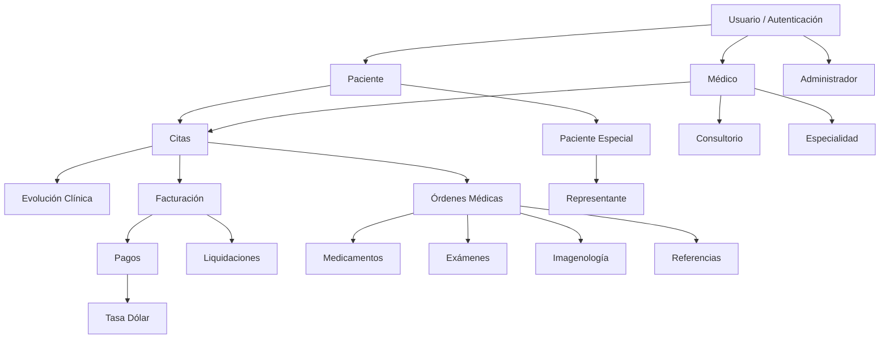

# Diagnóstico Técnico ReservaMedica — Fase de Despliegue a Producción

## Confirmación de Topología del Sistema

He analizado a fondo el proyecto. Confirmo la comprensión completa de la topología:

| Dimensión | Detalle |
|-----------|---------|
| **Framework** | Laravel 10.10 / PHP 8.1 |
| **BD** | MySQL (`SisReservaMedicas`) — 79 migraciones, 46 modelos Eloquent |
| **Frontend** | Blade + TailwindCSS 3.4 + Alpine.js + Axios |
| **Realtime** | Laravel Reverb 1.7 + Pusher.js 8.4 + Laravel Echo 2.3 |
| **Auth** | Guard `web` → Provider `usuarios` → Modelo [Usuario.php](file:///c:/laragon/www/ReservaMedica/app/Models/Usuario.php) con `md5(md5($value))` |
| **Hashing** | MD5 doble anidado (**se respeta por requerimiento del profesor**) |
| **Roles** | 3 roles (Admin/Root, Médico, Paciente) + Representante Legal |
| **Middleware** | 12 middlewares incluyendo [CheckRole.php](file:///c:/laragon/www/ReservaMedica/app/Http/Middleware/CheckRole.php) y [ValidateDoubleMD5.php](file:///c:/laragon/www/ReservaMedica/app/Http/Middleware/ValidateDoubleMD5.php) |
| **Capa Auth** | Comparación manual `md5(md5($input)) === $usuario->password` (no usa `Hash::check`) |

### Mapa de Dominios Confirmado



---

## FASE 1 — AUDITORÍA DE SEGURIDAD (Prioridad Cero)

### 1.1 Vulnerabilidades Críticas Detectadas

#### 🔴 CRÍTICO-01: Scripts de Debug/Diagnóstico Expuestos en Raíz

Los siguientes archivos PHP en la raíz del proyecto son ejecutables directamente vía web y exponen información sensible de la BD:

| Archivo | Riesgo |
|---------|--------|
| [check_security.php](file:///c:/laragon/www/ReservaMedica/check_security.php) | Expone hashes de preguntas de seguridad del usuario ID 7 |
| [check_hash.php](file:///c:/laragon/www/ReservaMedica/check_hash.php) | Expone lógica de hashing |
| [fix_db_auth.php](file:///c:/laragon/www/ReservaMedica/fix_db_auth.php) | Modifica datos de autenticación sin auth |
| [check_counts.php](file:///c:/laragon/www/ReservaMedica/check_counts.php) | Expone conteos de tablas |
| [debug_mail.php](file:///c:/laragon/www/ReservaMedica/debug_mail.php) | Expone configuración SMTP |
| [debug_mail_facade.php](file:///c:/laragon/www/ReservaMedica/debug_mail_facade.php) | Expone configuración SMTP |
| [migrate_security_answers.php](file:///c:/laragon/www/ReservaMedica/migrate_security_answers.php) | Modifica hashes en BD sin auth |
| [test_*.php](file:///c:/laragon/www/ReservaMedica/test_color.php) | Múltiples scripts de test |
| [reproduce_issue.php](file:///c:/laragon/www/ReservaMedica/reproduce_issue.php) | Debug script |
| [get_email.php](file:///c:/laragon/www/ReservaMedica/get_email.php) | Expone emails de usuarios |

**Acción:** Eliminar TODOS estos archivos antes de producción. No moverlos, eliminarlos del repositorio.

#### 🔴 CRÍTICO-02: `.env` con Configuración de Desarrollo

```
APP_ENV=local          ← DEBE ser production
APP_DEBUG=true         ← DEBE ser false (expone stack traces)
DB_PASSWORD=           ← Sin contraseña de BD
MAIL_HOST=127.0.0.1    ← Mailtrap local
MAIL_PORT=1025         ← Puerto de desarrollo
MAIL_ENCRYPTION=null   ← Sin cifrado SMTP
QUEUE_CONNECTION=sync  ← Bloquea requests en producción
BROADCAST_DRIVER=log   ← WebSockets desactivados
```

#### 🔴 CRÍTICO-03: Rate Limiting de Login Almacenado en Sesión

En [AuthController.php:93-96](file:///c:/laragon/www/ReservaMedica/app/Http/Controllers/AuthController.php#L93-L96):

```php
$sessionKey = "login_attempts_{$usuario->id}";
$attempts = session($sessionKey, 0) + 1;
session([$sessionKey => $attempts]);
```

> **Problema:** El atacante simplemente borra la cookie de sesión y resetea el contador a 0. El rate limiting no funciona.

#### 🟡 ALTO-01: Rutas AJAX de Citas Sin Autenticación

En [web.php:159-168](file:///c:/laragon/www/ReservaMedica/routes/web.php#L159-L168), las rutas bajo `ajax/citas/` son públicas:

```php
Route::prefix('ajax/citas')->group(function () {
    Route::get('/consultorios-por-estado/{estadoId}', ...);
    Route::get('/medicos', ...);
    Route::get('/horarios-disponibles', ...);
    Route::get('/get-next-sequence/{numero_documento}', ...); // ⚠️ Expone secuencia
    Route::get('/verificar-documento', ...); // ⚠️ Permite enumeración
});
```

> La ruta `verificar-documento` y `get-next-sequence` permiten a un atacante verificar si un número de documento existe en el sistema (enumeración de usuarios).

#### 🟡 ALTO-02: CORS Abierto Totalmente

En [cors.php](file:///c:/laragon/www/ReservaMedica/config/cors.php):
```php
'allowed_origins' => ['*'],
'allowed_methods' => ['*'],
'allowed_headers' => ['*'],
```

#### 🟡 ALTO-03: Sesión sin Cifrado y sin Cookie Segura

En [session.php](file:///c:/laragon/www/ReservaMedica/config/session.php):
```php
'encrypt' => false,         // Sesión en texto plano
'secure' => env('SESSION_SECURE_COOKIE'),  // Sin valor → null → HTTP
```

#### 🟡 ALTO-04: Rutas de Facturación, Pagos, Órdenes y Notificaciones Sin Middleware de Rol

En [web.php:413-497](file:///c:/laragon/www/ReservaMedica/routes/web.php#L413-L497):

```php
Route::resource('facturacion', FacturacionController::class);  // ← Solo auth, sin role
Route::resource('pagos', PagoController::class);               // ← Solo auth, sin role
Route::resource('ordenes-medicas', OrdenMedicaController::class); // ← Solo auth, sin role
Route::resource('notificaciones', NotificacionController::class); // ← Solo auth, sin role
```

> Un paciente autenticado puede acceder a `facturacion.index`, `pagos.index`, `ordenes-medicas.create`, etc.

#### 🟡 ALTO-05: Ausencia Total de Policies/Gates

El directorio `app/Policies` **no existe**. Toda la autorización se hace por middleware `role:X` a nivel de ruta, pero sin validación a nivel de modelo (ej: un médico no debería acceder a la evolución clínica de OTRO médico salvo con solicitud aprobada).

#### 🟢 MEDIO-01: Solo 2 FormRequests en Todo el Proyecto

Solo existen:
- [GenerarLiquidacionRequest.php](file:///c:/laragon/www/ReservaMedica/app/Http/Requests/GenerarLiquidacionRequest.php)
- [StoreFacturaRequest.php](file:///c:/laragon/www/ReservaMedica/app/Http/Requests/StoreFacturaRequest.php)

Los otros 22 controladores usan `Validator::make()` inline, lo cual mezcla validación con lógica de negocio (ej: [AuthController.php](file:///c:/laragon/www/ReservaMedica/app/Http/Controllers/AuthController.php) tiene 892 líneas, [CitaController.php](file:///c:/laragon/www/ReservaMedica/app/Http/Controllers/CitaController.php) tiene ~2000 líneas).

#### 🟢 MEDIO-02: Log de Debug en Producción

En [AuthController.php:238](file:///c:/laragon/www/ReservaMedica/app/Http/Controllers/AuthController.php#L238):
```php
Log::info('Iniciando registro debugging', $request->all());
```
> Esto logea contraseñas en texto plano al archivo de log.

---

## FASE 2 — PLAN DE BLINDAJE PARA PRODUCCIÓN

### Paso 1: Crear `.env.production` (archivo de referencia)

```env
# ===== APLICACIÓN =====
APP_NAME="Sistema de Reservas Médicas"
APP_ENV=production
APP_KEY=  # Generar nueva: php artisan key:generate
APP_DEBUG=false
APP_URL=https://tu-dominio.com

# ===== LOG =====
LOG_CHANNEL=daily
LOG_DEPRECATIONS_CHANNEL=null
LOG_LEVEL=warning

# ===== BASE DE DATOS =====
DB_CONNECTION=mysql
DB_HOST=127.0.0.1
DB_PORT=3306
DB_DATABASE=SisReservaMedicas
DB_USERNAME=reservamedica_app
DB_PASSWORD=C0nTr4s3ñ4_S3gUr4_Aqu1!

# ===== CACHE / SESIONES / COLAS =====
BROADCAST_DRIVER=reverb
CACHE_DRIVER=file
FILESYSTEM_DISK=local
QUEUE_CONNECTION=database
SESSION_DRIVER=database
SESSION_LIFETIME=30
SESSION_SECURE_COOKIE=true
SESSION_ENCRYPT=true

# ===== MAIL (SMTP Producción) =====
MAIL_MAILER=smtp
MAIL_HOST=smtp.tu-proveedor.com
MAIL_PORT=465
MAIL_USERNAME=sistema@clinica.com
MAIL_PASSWORD=password_smtp_seguro
MAIL_ENCRYPTION=ssl
MAIL_FROM_ADDRESS="sistema@clinica.com"
MAIL_FROM_NAME="Sistema Médico"

# ===== REVERB (WebSockets) =====
REVERB_APP_ID=reservamedica
REVERB_APP_KEY=tu_reverb_key_64chars
REVERB_APP_SECRET=tu_reverb_secret_64chars
REVERB_HOST=0.0.0.0
REVERB_PORT=8080
REVERB_SCHEME=https
```

### Paso 2: Hardening de Sesiones en `config/session.php`

```php
// Cambios requeridos:
'encrypt' => true,                     // Cifrar datos de sesión
'secure' => env('SESSION_SECURE_COOKIE', true),  // Solo HTTPS
'http_only' => true,                   // Ya está bien
'same_site' => 'strict',              // Cambiar de 'lax' a 'strict'
'lifetime' => env('SESSION_LIFETIME', 30),  // 30 min para salud
'expire_on_close' => true,            // Cerrar sesión al cerrar browser
```

### Paso 3: Fix del Rate Limiting de Login (Reemplazar Sesión por Cache)

Reemplazar en [AuthController.php](file:///c:/laragon/www/ReservaMedica/app/Http/Controllers/AuthController.php) el sistema basado en sesión por uno basado en cache con IP:

```php
// ANTES (vulnerable):
$sessionKey = "login_attempts_{$usuario->id}";
$attempts = session($sessionKey, 0) + 1;

// DESPUÉS (seguro):
use Illuminate\Support\Facades\Cache;

$cacheKey = "login_attempts_{$request->ip()}_{$usuario->id}";
$attempts = Cache::get($cacheKey, 0) + 1;
Cache::put($cacheKey, $attempts, now()->addMinutes(15));
```

Y lo mismo para `recovery_attempts` en `verifySecurityAnswers()`.

### Paso 4: Agregar Middleware de Rol a Rutas Desprotegidas

```php
// En web.php, cambiar:
Route::resource('facturacion', FacturacionController::class);
// Por:
Route::resource('facturacion', FacturacionController::class)
    ->middleware('role:admin|medico');

Route::resource('pagos', PagoController::class)
    ->middleware('role:admin');

Route::resource('ordenes-medicas', OrdenMedicaController::class)
    ->middleware('role:admin|medico');

Route::resource('notificaciones', NotificacionController::class)
    ->middleware('role:admin');

Route::resource('representantes', RepresentanteController::class)
    ->middleware('role:admin');

Route::resource('pacientes-especiales', PacienteEspecialController::class)
    ->middleware('role:admin');
```

### Paso 5: Asegurar Rutas AJAX Públicas

```php
// Agregar throttle a rutas sensibles:
Route::prefix('ajax/citas')->middleware('throttle:30,1')->group(function () {
    // ... rutas existentes ...
    
    // ELIMINAR o proteger estas rutas:
    // Route::get('/get-next-sequence/{numero_documento}', ...);  ← Mover a auth
    // Route::get('/verificar-documento', ...);  ← Mover a auth
});
```

### Paso 6: Restringir CORS para Producción

```php
// config/cors.php
'allowed_origins' => [env('APP_URL', 'https://tu-dominio.com')],
'allowed_methods' => ['GET', 'POST', 'PUT', 'DELETE', 'PATCH'],
'allowed_headers' => ['Content-Type', 'X-Requested-With', 'Authorization', 'X-CSRF-TOKEN'],
'supports_credentials' => true,
```

### Paso 7: Eliminar Scripts de Debug y Sanitizar Logs

```bash
# Eliminar scripts de diagnóstico de la raíz:
del check_counts.php check_hash.php check_patient_record.php
del check_plugin.php check_plugin_all.php check_security.php
del cleanup_history.php debug_design.php debug_mail.php
del debug_mail_facade.php diagnostico_manual.php fix_db_auth.php
del get_email.php inspect_history.php mail_test_script.php
del migrate_security_answers.php reproduce_issue.php
del test_color.php test_db_cli.php test_edit_perfil.php
del test_mail_logic.php verify_validation.php
```

Eliminar el log de contraseñas en [AuthController.php:238](file:///c:/laragon/www/ReservaMedica/app/Http/Controllers/AuthController.php#L238):
```php
// ELIMINAR esta línea:
Log::info('Iniciando registro debugging', $request->all());
```

### Paso 8: Comandos Artisan de Producción (Deploy Checklist)

```bash
# 1. Generar nueva APP_KEY (solo primera vez)
php artisan key:generate --force

# 2. Cachear configuración, rutas y vistas
php artisan config:cache
php artisan route:cache
php artisan view:cache

# 3. Optimizar autoloader de Composer
composer install --optimize-autoloader --no-dev

# 4. Crear tabla de sesiones en BD (si SESSION_DRIVER=database)
php artisan session:table
php artisan migrate --force

# 5. Crear tabla de colas (si QUEUE_CONNECTION=database)
php artisan queue:table
php artisan migrate --force

# 6. Compilar assets de producción
npm run build

# 7. Link de storage
php artisan storage:link

# 8. Permisos de directorios (Linux)
chmod -R 775 storage bootstrap/cache
chown -R www-data:www-data storage bootstrap/cache
```

### Paso 9: SSL/TLS Obligatorio

Crear/modificar middleware `ForceHttps` o agregar en `AppServiceProvider`:

```php
// app/Providers/AppServiceProvider.php → boot()
if (app()->environment('production')) {
    \Illuminate\Support\Facades\URL::forceScheme('https');
}
```

Y en el servidor web (Apache `.htaccess` o Nginx):

```apache
# .htaccess (dentro de /public)
RewriteEngine On
RewriteCond %{HTTPS} off
RewriteRule ^(.*)$ https://%{HTTP_HOST}%{REQUEST_URI} [L,R=301]
```

---

## FASE 3 — ESTRUCTURA DEL ENTORNO DE PRUEBAS

### Configuración de Testing con `.env.testing`

```env
APP_ENV=testing
APP_DEBUG=true
APP_KEY=base64:TEST_KEY_SEPARADA_AQUI

DB_CONNECTION=mysql
DB_DATABASE=SisReservaMedicas_test
DB_USERNAME=root
DB_PASSWORD=

QUEUE_CONNECTION=sync
MAIL_MAILER=log
BROADCAST_DRIVER=log
CACHE_DRIVER=array
SESSION_DRIVER=array
```

### Estructura de Tests Propuesta

```
tests/
├── Feature/
│   ├── Auth/
│   │   ├── LoginTest.php            # Login MD5 doble, bloqueo, rate limit
│   │   ├── RegisterTest.php         # Registro multi-rol
│   │   └── PasswordRecoveryTest.php # Preguntas seguridad, reset
│   ├── Citas/
│   │   ├── CrearCitaTest.php
│   │   ├── CambiarEstadoCitaTest.php
│   │   └── DisponibilidadHorarioTest.php
│   ├── HistoriaClinica/
│   │   ├── EvolucionTest.php
│   │   └── SolicitudAccesoTest.php
│   ├── Facturacion/
│   │   ├── FacturaPacienteTest.php
│   │   └── LiquidacionTest.php
│   └── Authorization/
│       ├── RoleMiddlewareTest.php
│       └── CrossRoleAccessTest.php
└── Unit/
    ├── Models/
    │   ├── UsuarioHashTest.php      # Verificar md5(md5()) funciona
    │   ├── CitaRelacionesTest.php
    │   └── OrdenMedicaCodigoTest.php
    └── Helpers/
        └── HelpersTest.php
```

### Test Crítico: Verificar Hash MD5 Doble

```php
// tests/Unit/Models/UsuarioHashTest.php
public function test_password_is_double_md5_hashed()
{
    $usuario = Usuario::create([
        'rol_id' => 3,
        'correo' => 'test@test.com',
        'password' => 'MiPassword123!',
        'status' => 1,
    ]);

    $expected = md5(md5('MiPassword123!'));
    $this->assertEquals($expected, $usuario->password);
}

public function test_login_verifies_double_md5()
{
    $response = $this->post('/login', [
        'correo' => 'test@test.com',
        'password' => 'MiPassword123!',
    ]);

    $this->assertAuthenticated();
}
```

---

## Resumen de Prioridades

| # | Acción | Severidad | Esfuerzo |
|---|--------|-----------|----------|
| 1 | Eliminar 20+ scripts PHP de debug en raíz | 🔴 Crítico | 5 min |
| 2 | Configurar `.env` para producción | 🔴 Crítico | 15 min |
| 3 | Fix rate limiting (session → cache) | 🔴 Crítico | 30 min |
| 4 | Agregar middleware `role:` a rutas desprotegidas | 🟡 Alto | 20 min |
| 5 | Restringir CORS | 🟡 Alto | 5 min |
| 6 | Habilitar `SESSION_ENCRYPT`, `SECURE_COOKIE`, `same_site=strict` | 🟡 Alto | 10 min |
| 7 | Proteger/eliminar rutas AJAX de enumeración | 🟡 Alto | 15 min |
| 8 | Eliminar `Log::info()` que logea passwords | 🟢 Medio | 2 min |
| 9 | Forzar HTTPS en producción | 🟡 Alto | 10 min |
| 10 | Deploy checklist (cache, build, permisos) | 🟢 Medio | 20 min |

---

## Open Questions

> [!IMPORTANT]
> **¿Quieres que proceda a ejecutar este plan?** Puedo empezar por las acciones críticas (eliminar scripts, fix rate limiting, hardening de rutas) y dejarte el `.env.production` listo. Confirma qué prioridad atacamos primero.

> [!NOTE]
> **Sobre el entorno de hosting:** ¿Ya tienes definido dónde se va a desplegar (VPS propio, shared hosting, DigitalOcean, AWS)? Esto determina la configuración de SSL, el supervisor para colas, y la configuración de Reverb para WebSockets.

> [!NOTE]
> **Sobre los tests:** ¿Quieres que genere la suite de tests como parte de este sprint, o lo dejamos para una fase posterior?
